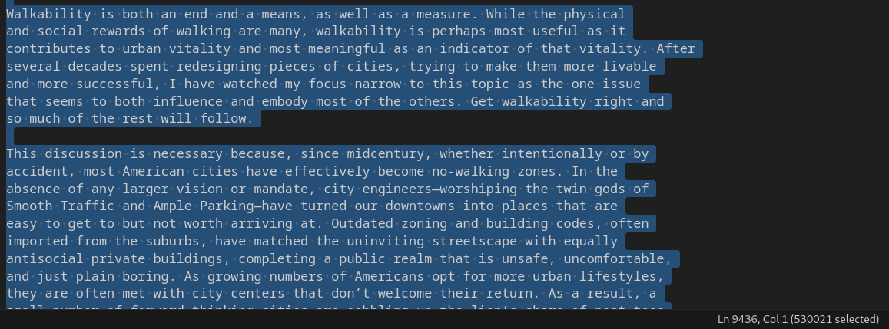
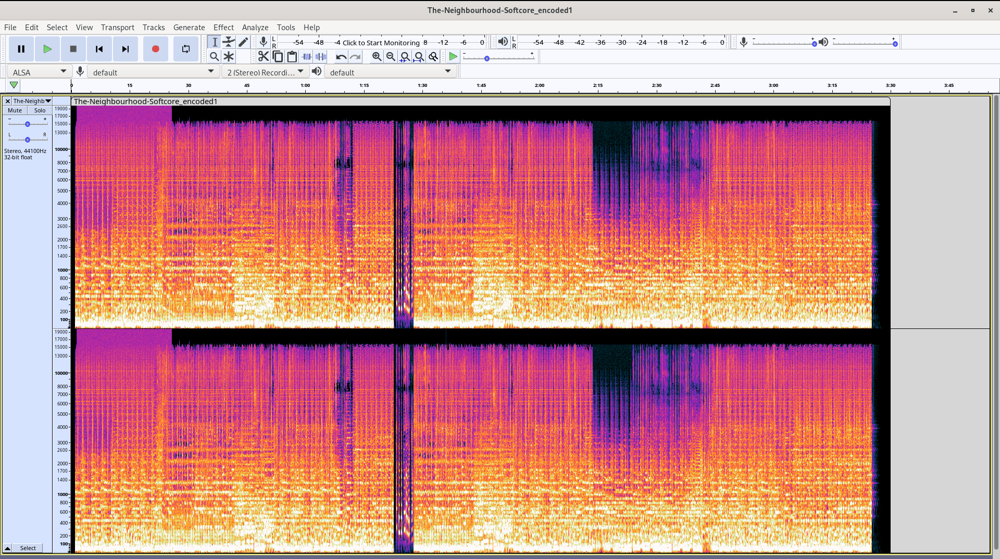
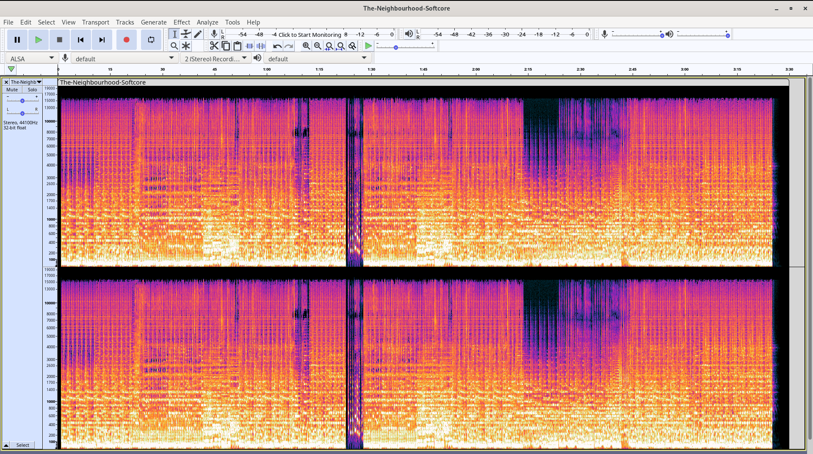
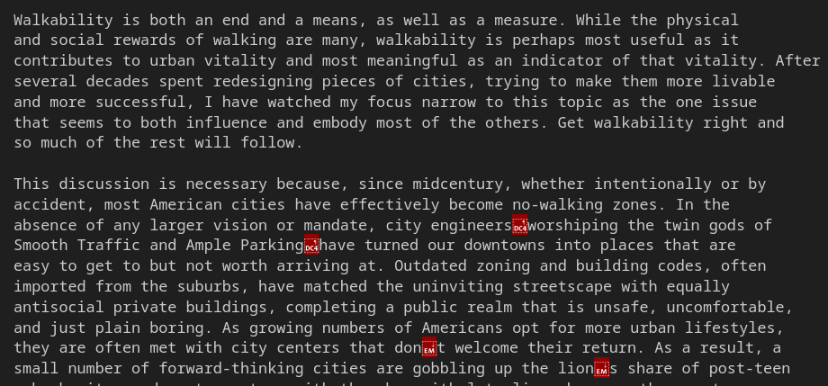

# Audio Class is in Steg-ssion

## What is Audio Steganography?

Audio steganography is the process of hiding a message within audio, using various possible different methods.

There are a few different common types of audio steganography:

- Least Significant Bit 
- Spread Spectrum
- Phase Coding
- Echo Hiding

We will be covering LSB steganography, and the other audio steganography group (Hi Henry and Perry!) will be covering Echo Hiding. The other methods use different kinds of changes and shifts to the audio waves to encode their data.

## Least Significant Bit Steganography

LSB stegonaraphy works similarly to the way that we did image steganography, by slightly modifying the least important bits of every byte of the audio file.
 

|1|0|1|1|0|0|1|0|
|-|-|-|-|-|-|-|-|
| | | | | | |^Message bit|^stop bit|

We write the message into the last bit (or bits), and reserve the rightmost least signifcant bit to indicate when to stop reading. (0 to continue writing, 1 right after writing ends)

If we were to write the letter `a` into this encoding system, we would need 8 bytes of audio data! For every byte of audio data here, we would use 1 bit, and each character byte is comprised of 8 bits. So for 8 of the audio bytes, in the 7th bit going left to right, we must put in this sequence of bits: `1100001`

In a sample audio file, it would look like this:

|128|64|32|16|8|4|2|1|
|-|-|-|-|-|-|-|-|
|0|0|0|1|0|0|1|0|
|1|0|1|0|0|0|1|0|
|0|0|1|1|0|0|0|0|
|1|1|0|1|0|1|0|0|
|1|0|1|1|0|0|0|0|
|1|1|1|1|1|0|0|0|
|1|0|1|1|0|0|0|0|
|0|1|1|1|0|0|1|0|
| | | | | | |^Message bit|^stop bit|

## Demonstration of Code

Let's try hiding text into some audio now! For our demonstration, we picked a rather large text, critically acclaimed text on urban planning, <i>Walkable City.</i>

 </img>

At over 500,000 characters, it must take up a big portion of our audio, right? Well...

After encoding the entire book into our ~3.5 minute song, at 1 bit of data per byte by running the following:

`make encode ARGS="Walkable_City.txt The-Neighbourhood-Softcore.wav"`

We get the following audio file: (<i>all spectrograms provided by Audacity</i>)

 </img>
As you can see, there is a long, continuous occupation of the entire vertical audio spectrum in this spectrogram in the first bit of the song. 

However, this doesn't actually take up the entire song! Only about the first 30 seconds, and even that's with the first second being empty. (because we told the program to start much later in the audio to avoid ear detection) 

<b>This may also have something to do with the fact that the .WAV file involved in this encode is massive- at over 35 MB. (yay for lossless codecs!)</b> 

If we take a listen to this audio, you could barely tell the difference between 1 bit encoding, and no encoding at all! What a miracle! 

For reference, here's the normal song's spectrogram:

 </img>
As you can see, there is no similarly shaped total vertical occupation of the spectrogram section as there was in the encoded audio.

Let's decode this audio and see what we get! After running the following:

`make decode ARGS="The-Neighbourhood-Softcore_encoded1.wav decoded.txt"`

We get this lovely text file!

 </img>

There is some sparse error with characters like `'` (mostly because we suck at working with UTF-8 ASCII), but besides that, the text of this legendary piece of literature remains!

Now, while we recommend the 1-bit option the most, we <b>CAN</b> choose to encode using even <b>MORE</b> bits. We can also try encoding with 2 or 4 bits of data per byte, so let's try those!

`make encode ARGS="Walkable_City.txt The-Neighbourhood-Softcore.wav 2"`

`make encode ARGS="Walkable_City.txt The-Neighbourhood-Softcore.wav 4"`

These will render us our two other encode variations.
What do they look and sound like? Well, let's start with look.

 </img>
 </img>

As you can see, the more bits we try to shove in one byte, the density, highlighted by the brightness of the sections of spectrogram, will increase, since more data is being shoved into this message-form replacement, rather than the original audio. 

Yet at the same time, the actual encoded portion continually shrinks. What will this sound like in audio form?

Let's first play the 2-bit, then the 4-bit, to see how much worse it gets in order.

### <b>TRIGGER WARNING: LOUD STATIC!</b>

Ouch. My ears are gone too, don't worry. But the main takeaway is this:

### <b>The more bits we sacrifice from the audio to our message, the less time it takes up, yes, but also the more noticeable it gets to an unsuspecting listener.</b>

As a secret little sneaky guy who wants to sneak messages into things like songs using LSB, you'd want to use as little bits per byte as possible in order to remain undetected. Don't worry, you'll have PLENTY of space to put your plans for world domination, as long as it's not the length of 7 books.